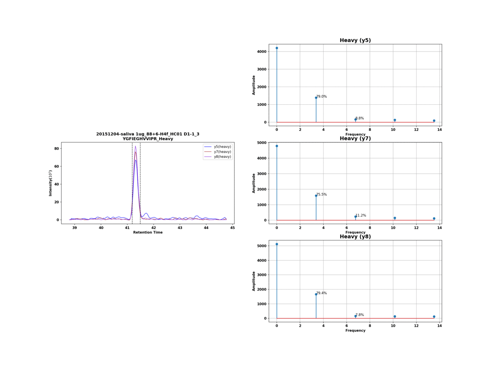

# automatic adjustment of MRM output boundary

Due to the inconvenient of adjustment the MRM output boundary artificially, we developed an automatic method to deal this task. With manual adjustment, there is no golden standard to set the boundary in certain places. The results will be varied depending on operators. As a result, we used frequency analysis (fft) of signals to find specific features for tuning peak boundary of MRM output data.

## Demo

## Explanation of Algorithm

We assume that MRM's peak intensity observes normal distribution. After "fast fourier transform (fft)", we expect to find tip-shape results that the first peak in frequence doamin will be hight. We randomly move the boundary left or right and caculate the proportison of first peak in frequence domain. Our goal is find the boundary that make this feature high as much as possible.

## Contributions
  
- provide a principle to adjust boundary
- time-saving
- resolve the systematic error by operators